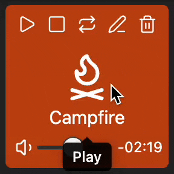
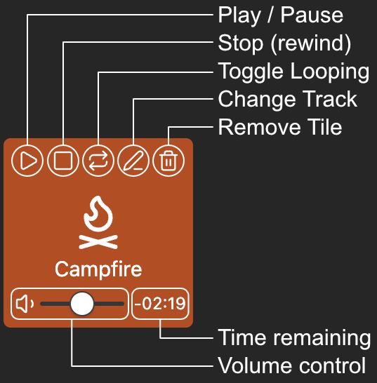
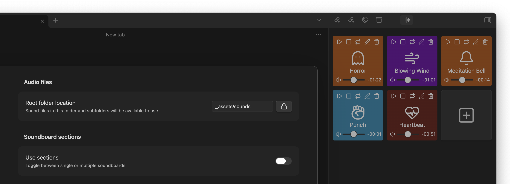
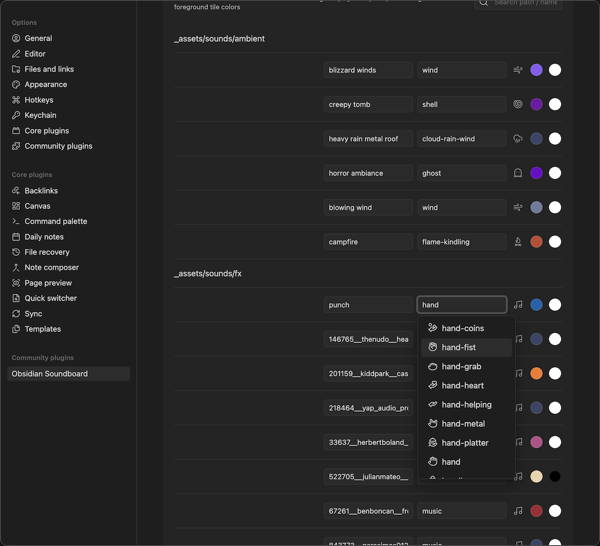

obsidian-soundboard
===

obsidian-soundboard is a plugin for [Obsidian](https://obsidian.md) that allows you to use local sound files to create soundboards and playlists for tracks, ambiance and sound effects.

> [!WARNING]
> Plugin under heavy development

But... why?
---

Because I use [Obsidian](https://obsidian.md) on my laptop to run an offline D&D campaign (thank you [@javalent](github.com/javalent/)!), and use background music, ambiance, and sound effects. I couln't find anything that would fit my needs: no internet access required, ability to use custom tracks, and light on battery usage.

So I decided to add my soundtracks to my D&D vault, and started building a weird soundboard / playlist mix.

This plugin is probably not for you. But if it is, I hope you find it useful and it helps you run some memorable games!

Installation
---

You can download the plugin from the [official obsidian plugin list](https://obsidian.md/plugins?search=soundboard) (pending [review]()), or use [BRAT](https://github.com/TfTHacker/obsidian42-brat) to install directly from github releases.

Remember to enable the plugin after installation!

Usage
---

- Create a folder in your vault to keep your audio files in (optional)
- Go into Settings -> Community Plugins -> Soundboard, and set your root folder. Only audio files in this folder will be available for `obsidian-soundboard` to use
  - Only files with the extension `.flac`, `.mp3`, `.mp4`, `.ogg`, or `.wav` will be available for usage.
- Show the Soundboard view by:
	- Clicking the plugin icon on the left toolbard: 
	- Using the `Soundboard: Open` command.

### Optional

- Enable and create sections
- Update track name, icon, and tile colors (background and foreground / text)

Features
---

### Tile based organization

Load audio tracks into tiles that can be independently controlled:

### Switch between single soundboard...

Single soundboard without any limits. Add, update, remove tiles as needed:

### ...or a board with multiple sections

Organize your tiles into sections / playlists that you can re-order, show / hide, and change playback mode (one-shot, or looping playlist)

### Customize track names, icon, and colors

Development
---

This project aims to have no runtime dependencies other than `obsidian`.

The custom soundboard view uses Svelte 5.

### Obsidian API Documentation

See https://docs.obsidian.md

Releasing new versions
---

- Ensure all tests, linters, and build have no issues.
- Run `npm version <major|minor|patch>`;
  - This will update the versions in `package.json`, `package-lock.json`, `manifest.json`, `versions.json` as well as generate the latest version of `CHANGELOG.md` and create a new git tag and commit where the commit message is the new version, in `major.minor.patch` format.
- `git push origin main`
- `git push origin --tags`
- The `.github/workflows/release` will then be run when this new tag is pushed, and create a [draft release](https://github.com/jgradim/obsidian-soundboard/releases)
